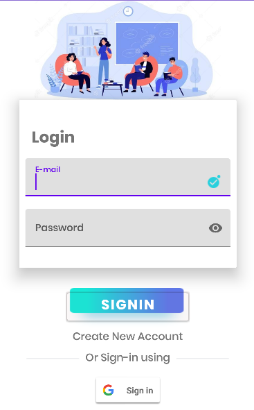
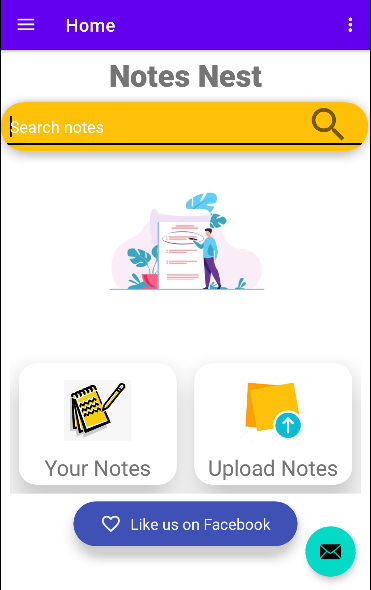
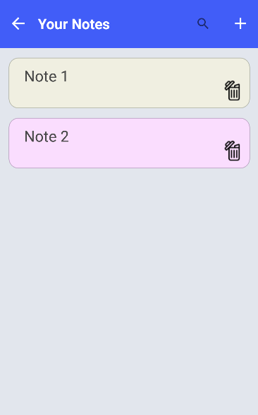
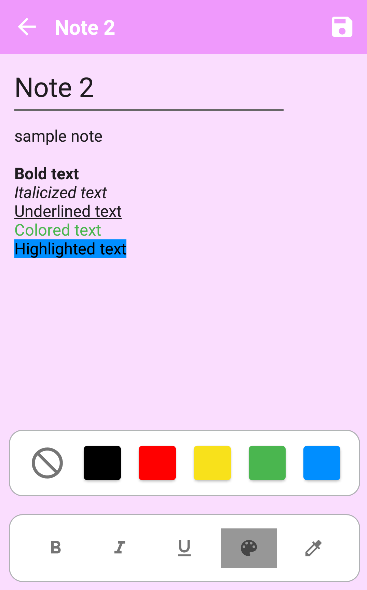
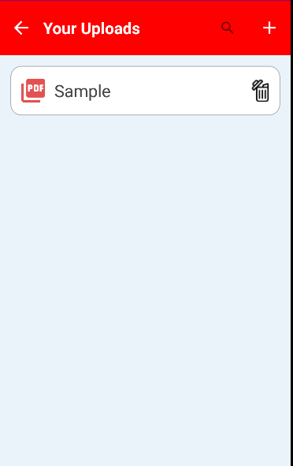

# Notes Nest 

Notes nest is a student facility equipment management application built with the sole purpose of facilitating quicker access and maintenance of the notes.

## Features of the App

* User Authentication (E-mail and Google)
* Create own notes
* Allows formatting of the notes (change style, text colors and hightlight)
* Upload notes in the PDF format and view
* Modify existing notes
* Delete existing notes and PDFs

## How to use the App

The user who is a student is allowed to register themselves on the application using valid credentials. It also allows to sign in using Google authentication. The user can view their profile after signing in.

The user can create their own notes or upload PDFs of their notes which are stored separately. While creating the notes, the user can also format it like bold, italicize, underline and also change the text colors and highlight the text. The notes added by a user is stored in the user's database created on Google Firebase.

## Technologies

Application is created with:
* Java
* Google Firebase
* Android Studio

## User Interface Snapshots

<table>
  <tr>
    <td>Splash Screen</td>
    <td>Login Page</td>
    <td>Dashboard</td>
  </tr>
  <tr>
    <td></td>
    <td></td>
    <td></td>
  </tr>
 </table>
 
 <table>
  <tr>
    <td>Navigation Bar</td>
    <td>User Profile</td>
    <td>User Notes</td>
  </tr>
  <tr>
    <td></td>
    <td></td>
    <td></td>
  </tr>
 </table>
 <table>
  <tr>
    <td>Creating Notes</td>
    <td>User PDFs</td>
  </tr>
  <tr>
    <td></td>
    <td></td>
  </tr>
 </table>
